

  <h1 class="almost_white">Machines of finite depth</h1>
  <h3 class="almost_white">Pietro Vertechi & Mattia G. Bergomi</h3>
  
pietro.vertechi@protonmail.com, mattiagbergomi@gmail.com

---

layout: true

  Limen Research

---

### Table of contents

- Background

--

- Machines
  - Composability
  - Resolvent
  - Independence

--

- Practical examples

--

- Optimization
  - Theory
  - Benchmarks

--

- Machines and the n-body problem
  - Neural operators
  - Brainstorming possible applications

--

- Conclusions

---

### Background

- Modern deep learning relies on complex, hand-crafted architectures.

- Designing such architectures is a difficult, time-consuming problem.

--

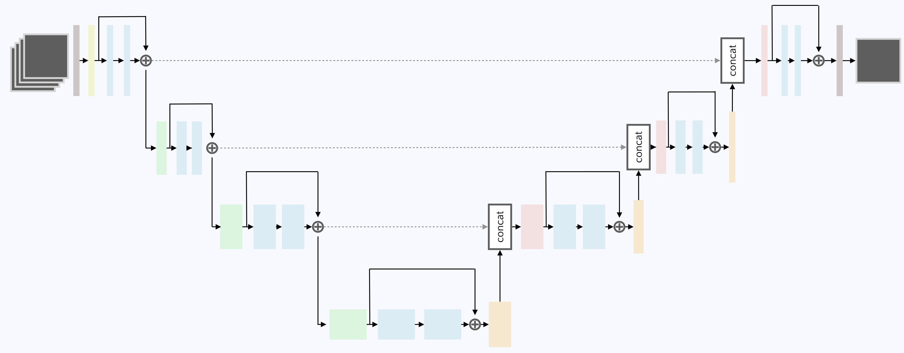
<small>Noori et al., 2020</small>

---

count: false

### Background

- Modern deep learning relies on complex, hand-crafted architectures.

- Designing such architectures is a difficult, time-consuming problem.

- Complex data processing requires deep architectures.

- Architecture depth can cause pathologies (instability, vanishing gradients).

---

count: false

### Background

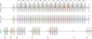
 
 
<small>He et al., 2015</small>

---

### Aim

- Formalize the notion of *neural network* and *neural architecture*.

- Define a *space of admissible architectures*.

- Determine the optimal architecture for a given problem.

---

### Formalizing neural networks — composition

.column-left[
How are layers combined to form a deep neural network?

Intuitively, function composition is the natural operation.

$$X_0 \rightarrow X_1 \rightarrow \dots \rightarrow X_n$$

Unfortunately, this does not include shortcut connections.
]

--

  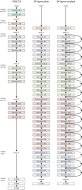
  <small>He et al., 2015</small>

  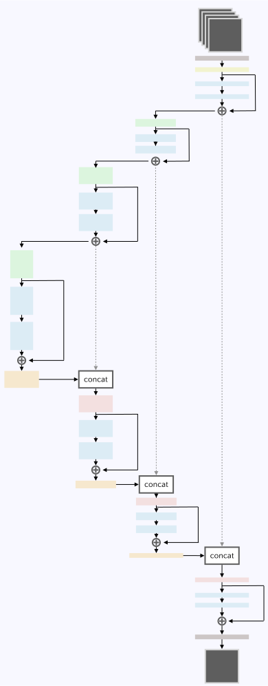
  <small>Noori et al., 2020</small>

---

### Formalizing neural networks — resolvent

.column-left.long[
Alternatively, given layers

$$X_0 \xrightarrow{l_1} X_1 \xrightarrow{l_2} \dots \xrightarrow{l_n} X_n,$$

consider the global space

$$X = X_0 \oplus X_1 \oplus \dots \oplus X_n$$

and the global network function

$$f = l_1 + \dots + l_n \colon X \rightarrow X.$$
]

--

.column-right-semi-wide[
A starting point
$$(x\_0, 0, 0, \dots, 0) \in X\_0 \oplus X\_1 \oplus X\_2 \oplus \dots \oplus X\_n$$
evolves as follows:
\\[
  \begin{aligned}
  &(x\_0,\; 0,\; 0,\; \dots,\; 0)\\\\
  &(x\_0,\; l\_1(x\_0),\; 0,\; \dots,\; 0)\\\\
  &(x\_0,\; l\_1(x\_0),\; l\_2(l\_1(x\_0)),\; \dots,\; 0)\\\\
  &\vdots\\\\
  &(x\_0,\; l\_1(x\_0),\; l\_2(l\_1(x\_0)),\; \dots,\; l\_n(l\_\{n-1\}\dots(l\_1(x\_0)))).\\\\
  \end{aligned}
\\]
]

--

.column-right-semi-wide[
  End point is solution of
  $$x = f(x) + x_0.$$
]

---

### Formalizing neural networks — resolvent

.column-left-wide[
**Intuition.**

The output of a network $f$ with input $x_0$ satisfies the *machine equation*
$x = f(x) + x_0$.
]

--

.column-left-wide[
**Definition.**

We say that $f$ is a *machine* if, for any $x_0$, there is a unique solution to
$$x = f(x) + x_0,$$
and this unique solution depends smoothly on $x_0$.
]

--

.column-left-wide[
In practice we are computing $x = (\textnormal{id} - f)^{-1}(x_0)$.

We call the operator $R_f = (\textnormal{id} - f)^{-1}$ the *resolvent* of $f$.
]

---

### Formalizing neural networks — independence

.column-left-wider[
**Definition.**

Let $f_1, f_2 \colon X \to X$ be endofunctions.

We say that $f_1$ *does not depend on* $f_2$ if, for all $a, b \in \mathbb{R}$,
$$f_1(af_2 + b) = f_1(b).$$
]

--

.column-left-wider[
**Proposition.**

Let $f = f\_1 + f\_2$. If $f\_1$ does not depend on $f\_2$, then
$$R\_f = R\_{f\_2} R\_{f\_1},$$
i.e., the resolvent of the sum is the composition of the resolvents.
]

--

.column-left-wider[
**Intuition.**

Before computing one layer, one must compute its “dependencies”.
]

---

### Complex architectures via hypergraphs

.float-left[
Hypergraphs allow for edges to connect to arbitrarily large collections of vertices.

Thus, shortcut connections can be very complex.

 
 
]

--

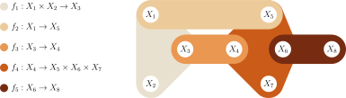

---

### Machines with *all* shortcuts

.column-left-wide[
In practice, we will often choose to work with all shortcuts.
]

.column-left-wide.clear-left[
**Recipe.**

- Start with a layer (dense or convolutional) whose input and output share a common index space $I$.

- Partition the index space $I = I\_1 \sqcup I\_2 \sqcup \dots \sqcup I\_n$.

- Set to $0$ weights connecting $I\_i$ to $I\_j$ with $i \ge j$.
]

--

.column-left-wide.clear-left[
**Examples.**

- Dense machine.

- Convolutional machine.

- Time machine (recurrent/convolution hybrid).
]

---

   
   
  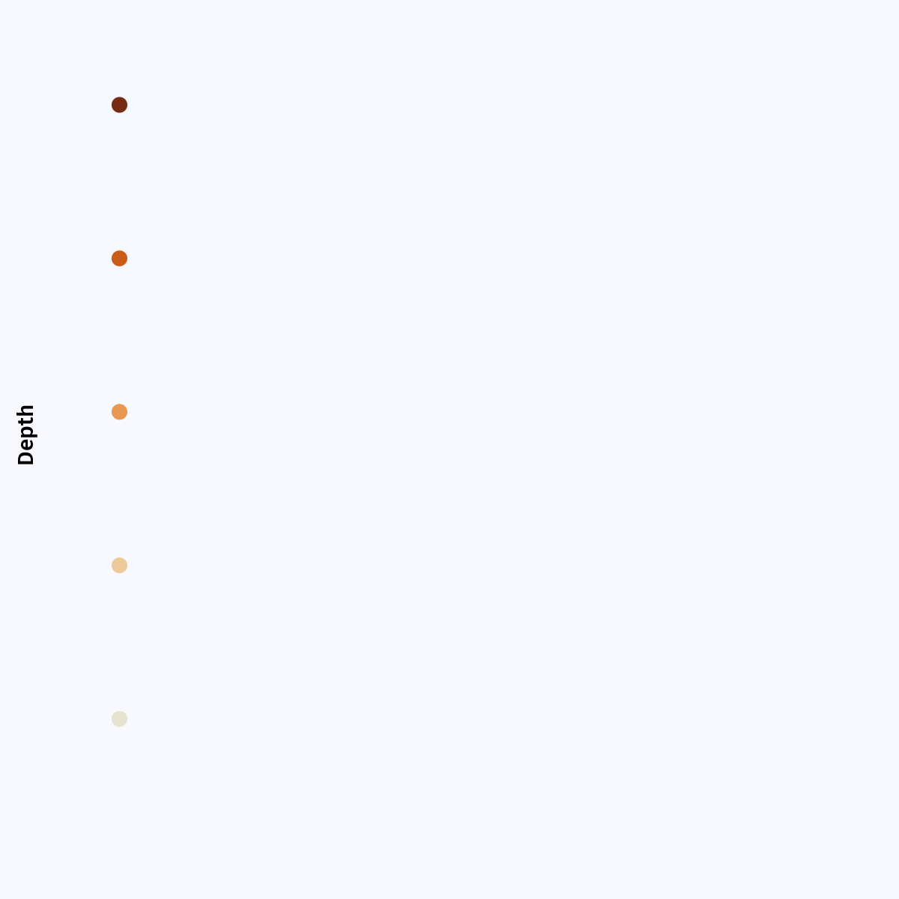

.column-right[
  <h3 class="margin-bottom">Feedforward architecture</h3>

  Feedforward machine with all shortcuts.

  Each node receives inputs from all nodes of smaller depth.
]

---

count: false

   
   
  

.column-right[
  <h3 class="margin-bottom">Feedforward architecture</h3>

  Feedforward machine with all shortcuts.

  Each node receives inputs from all nodes of smaller depth.
]

---

   
   
  

.column-right[
  <h3 class="margin-bottom">Recurrent / convolution hybrid</h3>

  Unrolled representation.

  Each node receives inputs from
  - nodes of smaller depth from same timestep,
  - all nodes from previous timestep.
]

---

count: false

   
   
  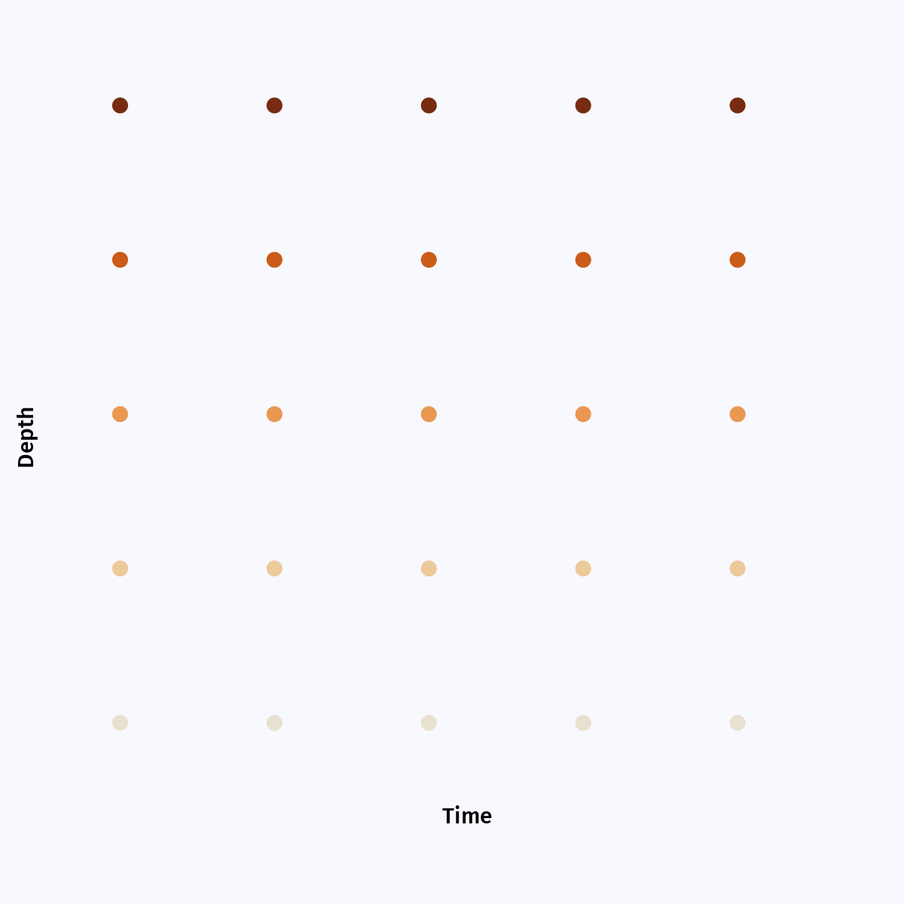

.column-right[
  <h3 class="margin-bottom">Recurrent / convolution hybrid</h3>

  Unrolled representation.

  Each node receives inputs from
  - nodes of smaller depth from same timestep,
  - all nodes from previous timestep.
]
---

### Optimization

.float-left[
**Definition.**

A parametric machine is a smooth parametric function $f(p, x)$ such that
- $f(p, -)$ is a machine for all choice of parameters $p$,
- the resolvent $R\_f(p, x\_0)$ is jointly smooth in $p$ and $x\_0$.
]

--

.column-left-wider[
As in classical deep learning, after computing the output
$$x = f(p, x) + x_0,$$
we evaluate the loss function
$$\mathcal{L}(x).$$

Then, we backpropagate the error through the machine and obtain
$$\frac{\partial\mathcal{L}}{\partial p}.$$
]

---

### Optimization

.column-left-semi-wide[
**Reminder.**

The backpropagation procedure, used in Deep Learning to compute gradients, consists of the following two steps:

- for each operator involved in the forward pass, compute the adjoint of its differential,

- compose the adjoints in reversed order.
]

--

.column-left-semi-wide[
**Rationale.**

For a scalar-valued function, this is much more efficient than explicitly computing and storing all intermediate Jacobian matrices.

]

---

.column-left-semi-wide[

<h3 class="margin-bottom">Optimization</h3>

**Proposition.**

The differential of the resolvent of a machine $f$ is the resolvent of the differential of $f$.

$$
\frac{\partial R\_f}{\partial x\_0}
= \frac{\partial}{\partial x\_0}\left(\textnormal{id} - f \right)^{-1}
= \left(\textnormal{id} - \frac{\partial f}{\partial x}\right)^{-1}
= R\_\frac{\partial f}{\partial x}.
$$
]

--

.half-width-wide[
By taking adjoints,

$$
\left(\frac{\partial R\_f}{\partial x\_0}\right)^\ast
= R\_{\left(\frac{\partial f}{\partial x\_0}\right)^\ast}.
$$

]

---

count: false

.column-left-semi-wide[

<h3 class="margin-bottom">Optimization</h3>

**Proposition.**

The differential of the resolvent of a machine $f$ is the resolvent of the differential of $f$.

$$
\frac{\partial R\_f}{\partial x\_0}
= \frac{\partial}{\partial x\_0}\left(\textnormal{id} - f \right)^{-1}
= \left(\textnormal{id} - \frac{\partial f}{\partial x}\right)^{-1}
= R\_\frac{\partial f}{\partial x}.
$$

By taking adjoints,

$$
\left(\frac{\partial R\_f}{\partial x\_0}\right)^\ast
= R\_{\left(\frac{\partial f}{\partial x\_0}\right)^\ast}.
$$

**Computational consequences.**

The backward pass of a machine is again a machine.

]

--

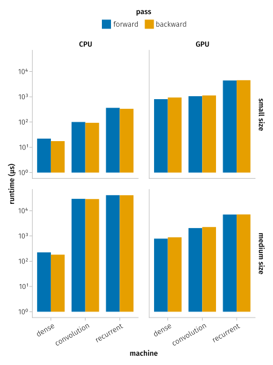

---

### Example application

.column-left[
  We have trained parametric machines on several example datasets.

  Here, we look at forecast on timeseries data (energy demands of various users).
]

---

count: false

### Example application

.column-left[
  We have trained parametric machines on several example datasets.

  Here, we look at forecast on timeseries data (energy demands of various users).

  - Machines can outperform sequential neural networks.

  - Machines have fewer parameters, hence better generalization capabilities, than sequential neural networks.
]

--

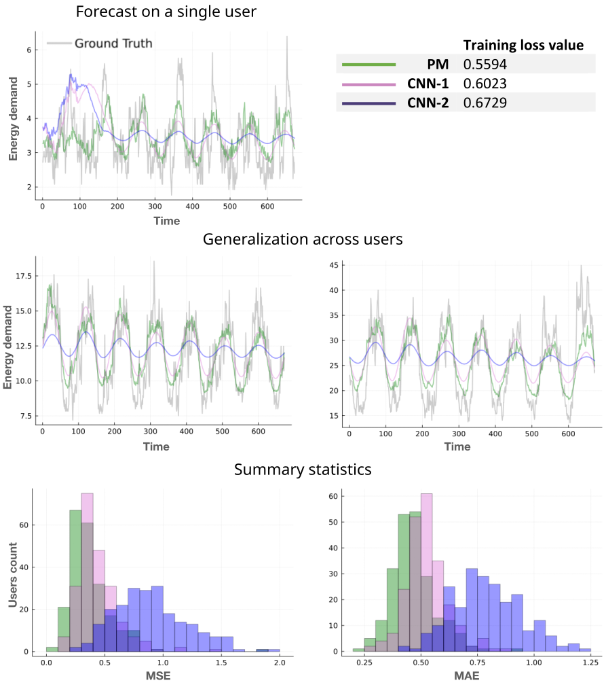
<small>Martina Garavaglia & Paola Serra (Master thesis)</small>

---

### Summary so far

--

- Hand-crafted architectures require highly trained experts and time-consuming fine-tuning.

--

- We created a formal environment in which complex neural architectures can be described.

--

- The resolvent generalizes the computation of a neural network.

--

- Complex machines can be built from smaller ones.

--

- In theory and in the examples we consider, the backward pass is analogous to the forward pass in terms of
  - structure,
  - computational cost.

--

- Due to the smaller number of parameters, machines tend to generalize better than traditional neural networks.

---

### Neural operators

.container[
  Traditional deep learning layers operate on finite-dimensional vector spaces.
  
  Recently, there was a surge of interest in *neural operators*—deep learning layers defined on function spaces.
]

--

.container[
  **A simple example.**

  Alternate the following two layers (below, $x$ is a smooth function defined on $\mathbb R^d$).

  - Linear layer $x \mapsto w * x$, where $w \in C^{\infty}_0(\mathbb R^d)$ (convolution is computed via Fourier Transform).

  - Nonlinear layer $x \mapsto \sigma \circ x$, where $\sigma\colon \mathbb R \rightarrow \mathbb R$ is a smooth scalar function.
]

--

.container[
  In general, $w$ is allowed to vary parametrically, whereas the nonlinearity $\sigma$ is fixed.
]

---

### Neural operators - applications (PDEs)

.container[
A key domain of applications is the resolution of Partial Differential Equations.
]

--

**Navier Stokes equation.**

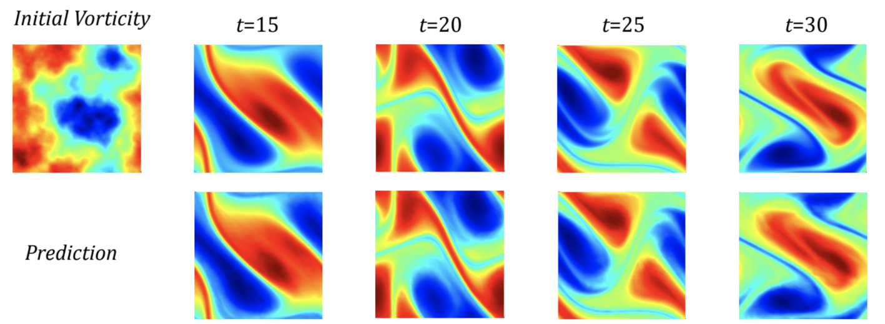
 
<small>Li et al., 2021</small>

---

### Neural operators - applications (wind forecast)

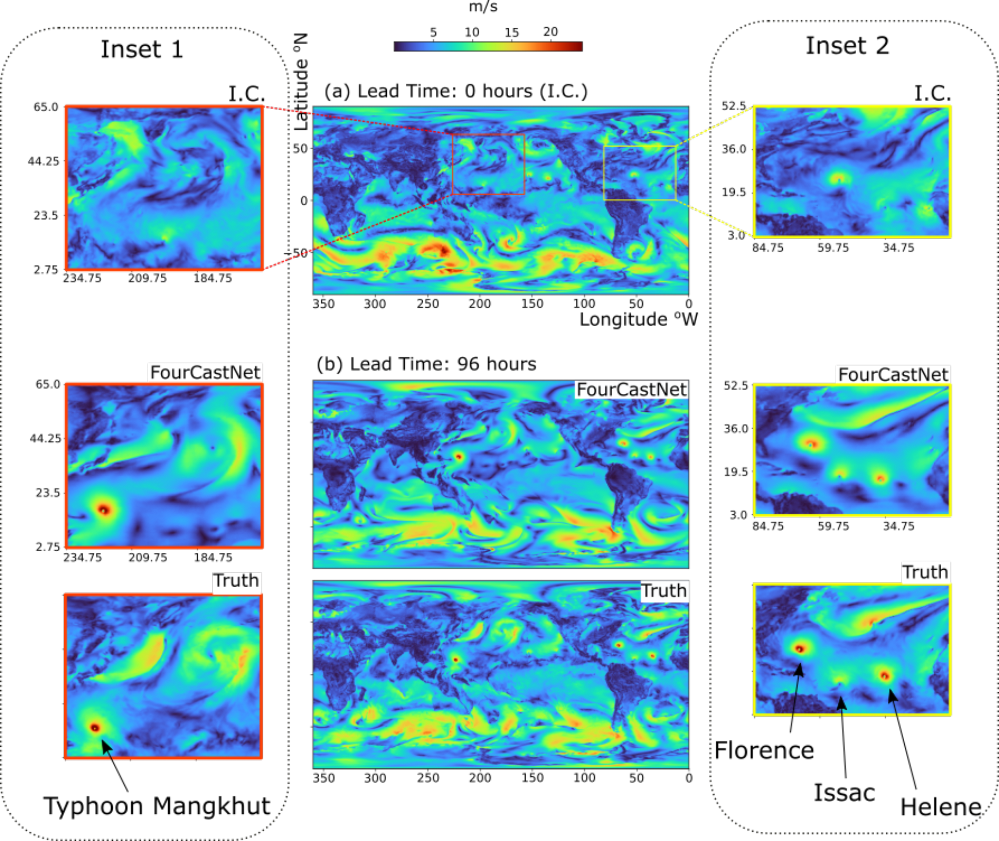
 
<small>Pathak et al., 2022</small>

---

### Machines and neural operators

.container[
- The current implementation of [parametric machines](https://github.com/LimenResearch/ParametricMachinesDemos.jl) only supports finite-dimensial neural layers (e.g., dense or convolutional).

- There is ongoing work to generalize machines to support arbitrary (finite- or infinite-dimensional) neural layers.
]

--

.container[
**Expected benefits.**

- Neural operator machines might require fewer parameters than neural operator networks, and thus generalize better.

- Thanks to the rich shortcut structure of machines, less fine-tuning of the weight functions $w$ should be required. 
]

---

### Brainstorming of possible applications to the n-body problem

- Use mass distribution over time, e.g., $m \in C^{\infty}(\mathbb R^{3+1})$, to encode a n-body system.

- Train a machine $C^{\infty}(\mathbb R^{3+1}) \to C^{\infty}(\mathbb R^{3+1})$ to predict trajectories.

--

### Open questions

- What is the goal of such a machine, other than trajectory prediction?

- Should we incorporate symmetry / periodicity constraints in the loss function?

- Should we aim to minimize physical quantities while simulating trajectories?
